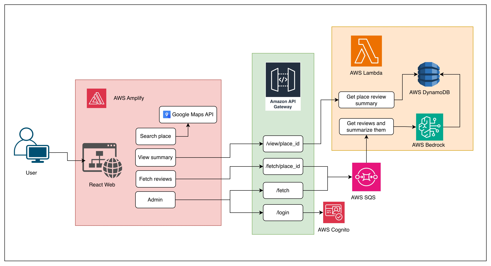

# Review Catcher

A tool that you can search places such as restaurant and tourist attraction from Google Map, and check the review summary produced by genAI.

## System Structure

## Lambda Functions

#### Summarize Reviews

`Get mission from AWS SQS` -> 
`Get reviews of the place` -> `Store reviews into AWS DynamoDB` -> `Send prompt and reviews to AWS Bedrock to generate summary` -> `Store summary into AWS DynamoDB and update the status`

- Get Summary

`Get summary and reviews from AWS DynamoDB`
